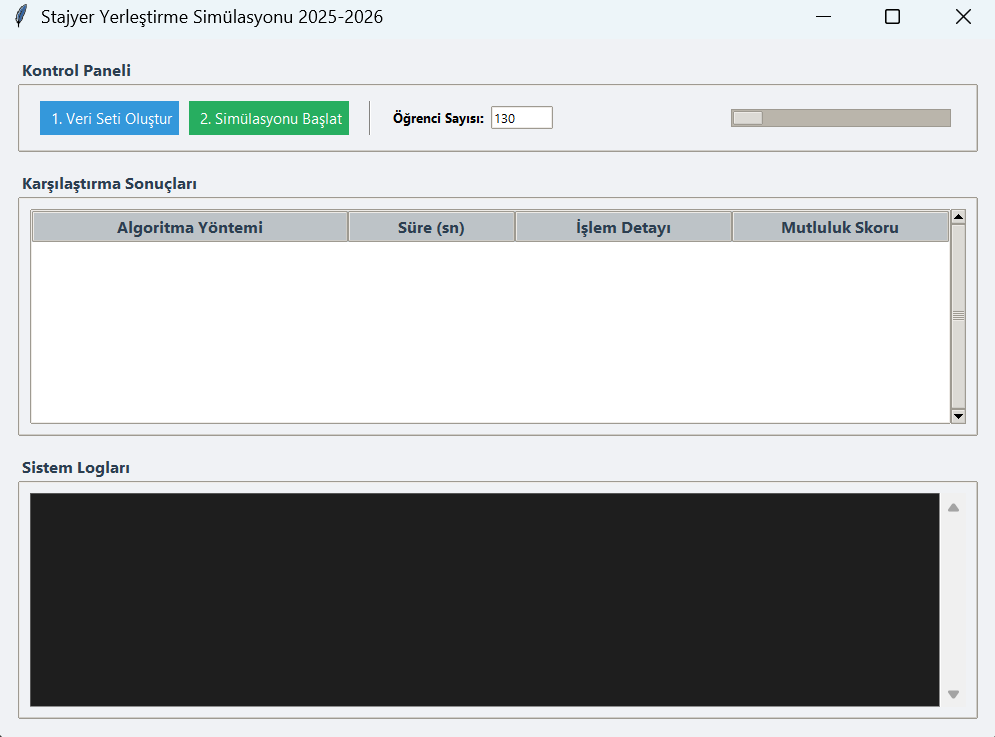
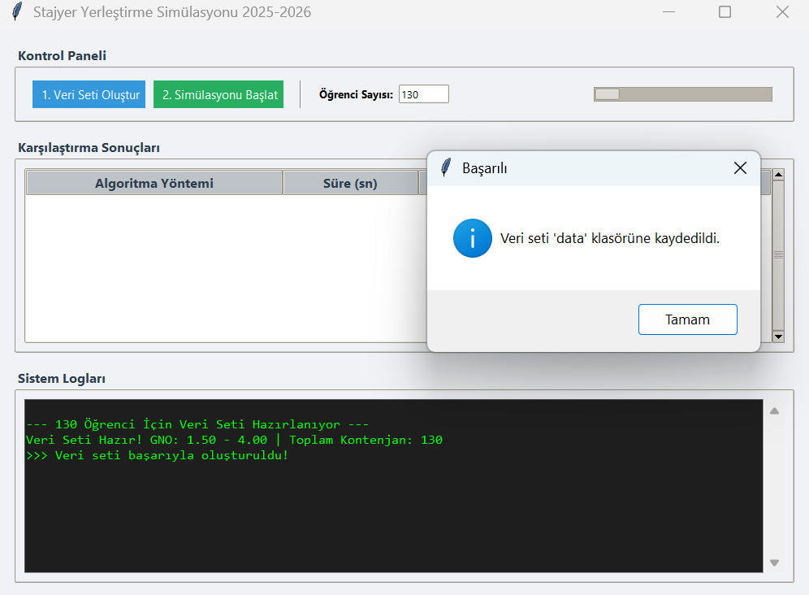
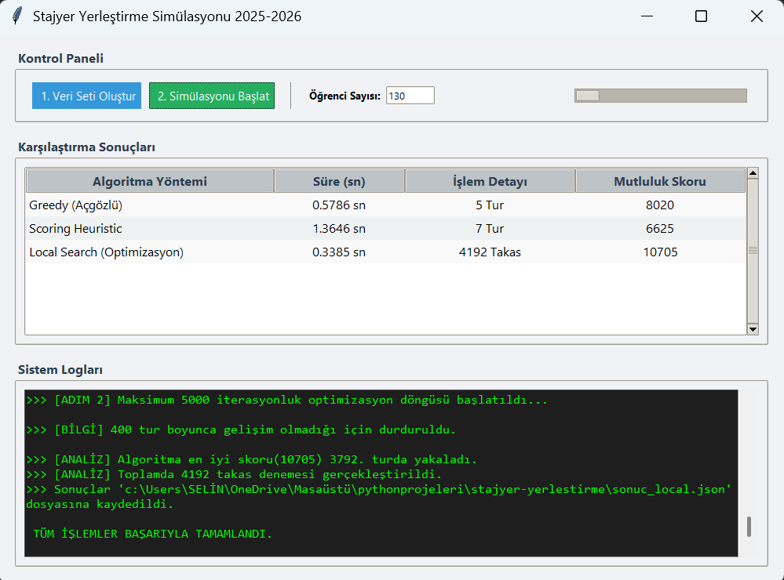

# stajyer-yerlestirme-simulasyonu

Bu proje, **Python Programlama** dersi kapsamında geliştirilmiş; kısıtlı kaynakların (staj kontenjanları) yoğun talep altındaki birimlere (öğrenciler) atanması problemini (**Resource Constrained Assignment Problem**) çözen kapsamlı bir simülasyon uygulamasıdır.

Sistem, sadece akademik başarıyı değil, **"Toplam Mutluluk Skoru"nu (Global Happiness Score)** maksimize etmeyi hedeflerken; gerçek hayattaki **reddedilme** ve **mülakat uyumsuzluğu** senaryolarını da simüle eder.

## Projenin Amacı ve Kapsamı

Gerçek hayatta firmaların kapasiteleri sınırlıdır ve öğrencilerin tercihleri genellikle popüler firmalarda çakışır. Bu proje, bu kaotik süreci yönetmek için **3 farklı algoritma** geliştirerek performanslarını karşılaştırır.

Simülasyonun temel özellikleri şunlardır:
* **Stokastik Reddetme Mekanizması:** Firmalar, popülaritelerine göre belirli olasılıklarla öğrencileri reddedebilir. Bu süreçte **Simulated Annealing** (Tavlama Benzetimi) yaklaşımından esinlenen bir "soğuma takvimi" kullanılır.
* **Döngüsel (Iterative) Simülasyon:** Yerleştirme tek seferde olmaz; reddedilen öğrenciler havuza döner ve sistem kararlı hale (stable state) gelene kadar döngü devam eder.
* **Sentetik Veri Üretimi:** 130 öğrenci ve 40 firma (Trendyol, Aselsan vb. temsili) içeren gerçekçi bir veri seti, `dataset_hazirlayici.py` modülü ile akademik gerçekliğe uygun (GNO 1.50-4.00 arası) üretilir.

---

## Kullanılan Algoritmalar

Projede, çözüm uzayını taramak ve optimum eşleşmeyi bulmak için üç farklı yaklaşım geliştirilmiştir:

### 1. Açgözlü Yaklaşım (Greedy Algorithm)
*"Bireysel Liyakat Önceliği"*

Bu algoritma, deterministik bir yaklaşımla öğrencileri **Genel Not Ortalamasına (GNO)** göre büyükten küçüğe sıralar.
* **Mantık:** En başarılı öğrenci, tercih listesindeki en üst sıradaki boş firmaya yerleşir.
* **Karmaşıklık:** $O(N \log N)$ (Sıralama maliyeti).
* **Sonuç:** Hızlıdır ancak "toplam mutluluğu" garanti etmez, sadece yüksek puanlıları mutlu eder.

### 2. Puan Bazlı Sezgisel (Scoring Heuristic)
*"Hibrit Karar Mekanizması"*

Bu yöntem, problemi sadece GNO değil, öğrencinin isteğini de katan çok boyutlu bir optimizasyon olarak ele alır. Her eşleşme için bir **"Uygunluk Skoru"** hesaplar:

$$S_{i,j} = (\alpha \times GNO_{i}) + (\beta - \gamma \times Rank_{i,j})$$

* **Mantık:** Öğrencinin tercih listesinde aşağı inmesi ceza puanı oluşturur. Bu algoritma, "Çok İsteyen" öğrencilere, "Puanı Biraz Yüksek Olan" öğrencilere karşı stratejik avantaj sağlar.
* **Avantaj:** Akademik başarı ile bireysel tatmin arasında denge kurar.

### 3. Yerel Arama (Local Search - Hill Climbing)
*"İleri Optimizasyon"*

Rastgele bir başlangıç çözümünü, **takas (swap)** işlemleriyle adım adım iyileştiren sezgisel yöntemdir.
* **Mantık:** Rastgele iki öğrenci seçilir ve firmaları değiştirilir. Eğer yeni durumdaki **Toplam Mutluluk Skoru** artıyorsa değişiklik kabul edilir, artmıyorsa geri alınır.
* **Durdurma Kriteri:** "Sabır" (Patience) mekanizması ile 400 iterasyon boyunca iyileşme olmazsa algoritma durur.
* **Performans:** Deneylerde **10.750 puan** ile en yüksek skoru ve kararlılığı bu algoritma sağlamıştır.

---

## Mutluluk Skoru (Metric)

Algoritmaların başarısı aşağıdaki puanlama sistemine göre ölçülür:

| Durum | Puan Etkisi |
| :--- | :--- |
| **1. Tercihe Yerleşme** | +100 Puan |
| **2. Tercihe Yerleşme** | +85 Puan |
| **3. Tercihe Yerleşme** | +70 Puan |
| **4. Tercihe Yerleşme** | +55 Puan |
| **5. Tercihe Yerleşme** | +40 Puan |
| **Tercih Dışı Yerleşme** | +10 Puan |
| **Açıkta Kalma (Ceza)** | **-500 Puan** |

---

## Arayüz ve Teknik Detaylar

Uygulama, kullanıcı dostu bir deneyim için **Python Tkinter** kütüphanesi ile geliştirilmiştir.

* **Multi-Threading:** Arayüzün donmasını engellemek için hesaplama işlemleri arka planda (worker threads) çalıştırılır.
* **Log Terminali:** Kullanıcı, algoritmaların adımlarını (yerleşen sayısı, reddedilen sayısı, tur döngüleri) anlık olarak kaydırılabilir terminalden izleyebilir.
* **Veri Yönetimi:** Sonuçlar ve öğrenci verileri JSON formatında tutularak simülasyonlar arası veri bütünlüğü sağlanır.

## Ekran Görüntüleri

---

---

---

## Takım Üyeleri

Bu proje aşağıdaki ekip tarafından geliştirilmiştir:

* **Selin Şentürk**
* **Pınar Nida Tunca**
* **Selen Yakın**

---
*Bu proje akademik amaçla hazırlanmış olup, İMEP staj süreçlerine algoritmik bir bakış açısı getirmeyi amaçlamaktadır.*
